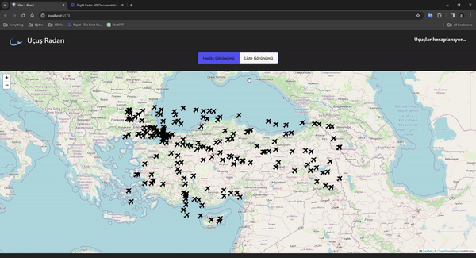

# Flight Radar
I cloned a flight radar with React. I used Redux Toolkit for state management some other libraries for the dinamics. 

I placed the flight data from the API on the map one by one. Afterwards, I completed the project with a modal that allows us to access the specific information of the flights.

# Libraries
- @reduxjs/toolkit / axios / @splidejs/react-splide / react-redux / leaflet / react-leaflet / react-paginate / moment

